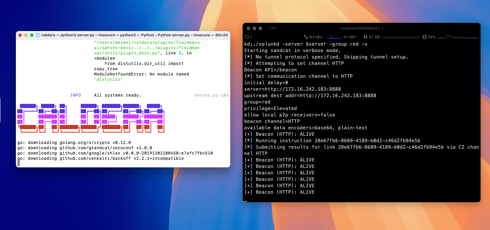
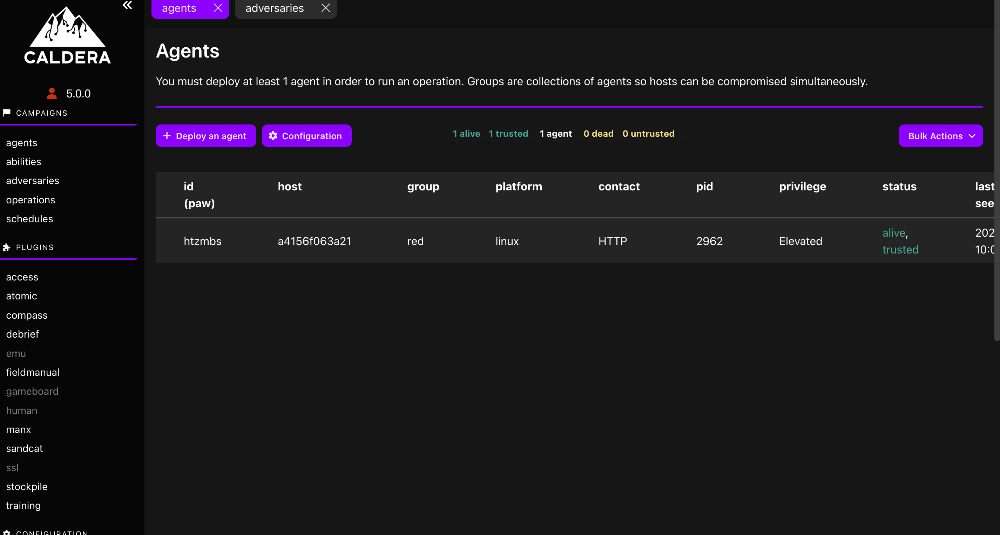
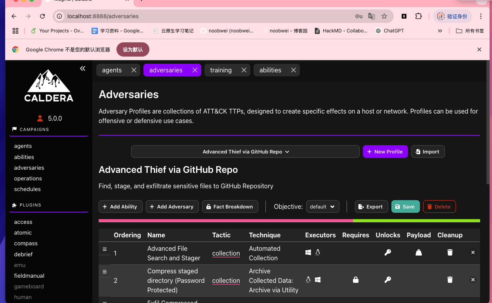
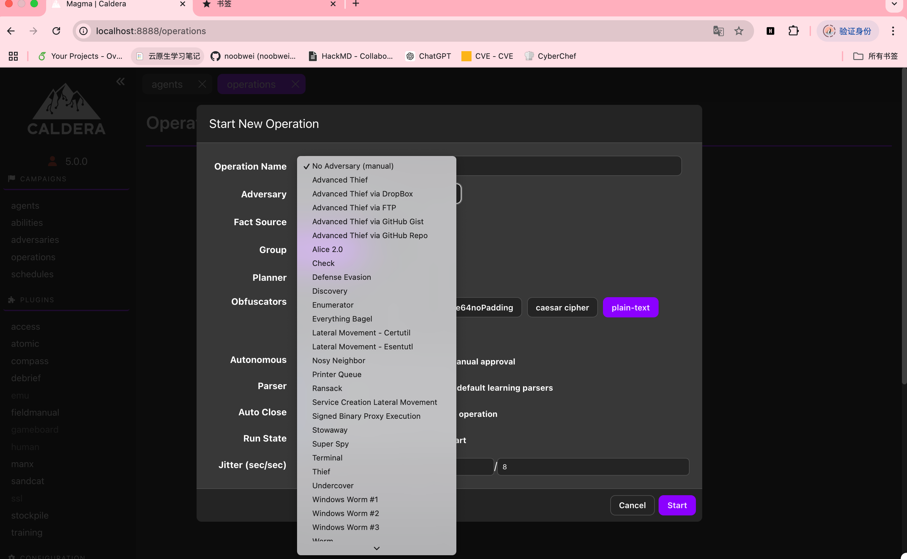
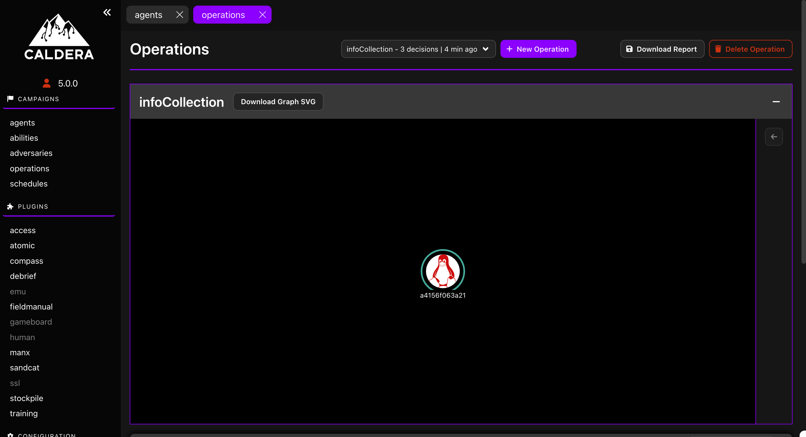

## Caldera

使用MacOS 本机部署Caldera Server+Docker部署受害机

参考https://caldera.readthedocs.io/en/latest/Installing-Caldera.html#offline-installation

在部署agent之前通过`ipconfig getifaddr en0`获取本机的IP，可以在docker中尝试curl来验证是否连通

可以看到agent上线

在agent上线后可以根据mitre的整体架构选择Operation
但由于靶机是新建的空ubuntu，随机选取一个操作后并没有什么返回

